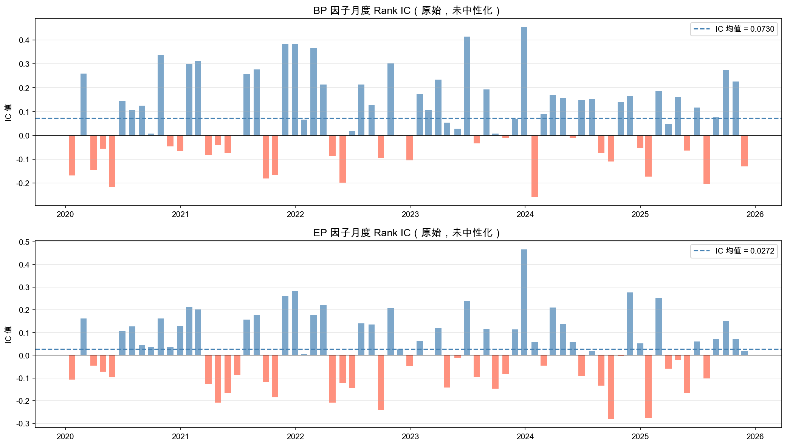
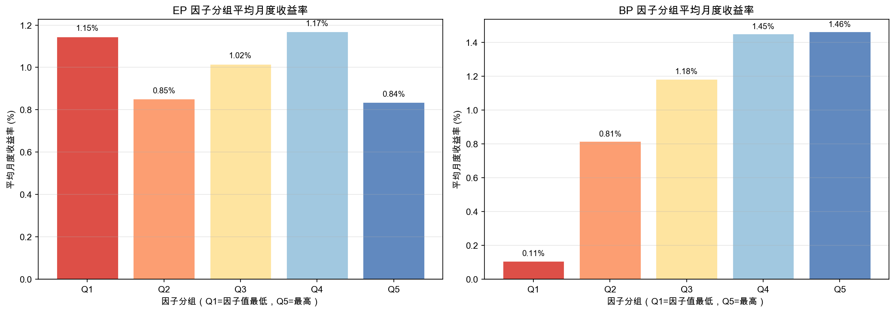
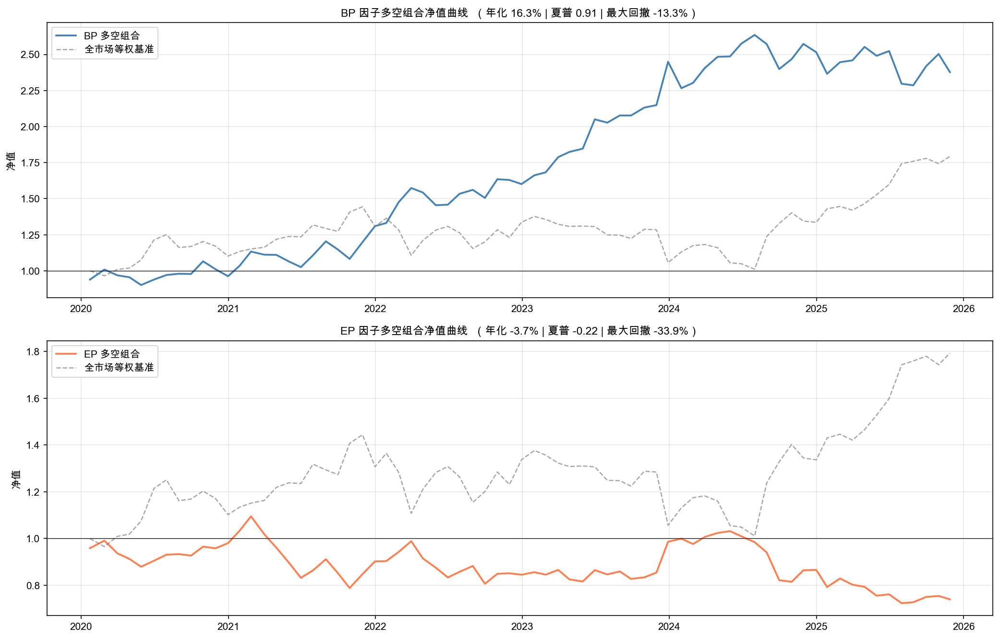

# A-Share Value Factor Research
### Cross-sectional BP & EP factor analysis on Chinese A-share market (2020–2025)

---

## Project Overview

This project builds a cross-sectional factor research framework on the A-share market,
testing whether classic value factors — **BP (Book-to-Price)** and **EP (Earnings-to-Price)**
— have predictive power for future stock returns in the Chinese equity market.

The full pipeline covers data ingestion, cleaning, factor construction, 
neutralisation, quintile backtesting, and IC analysis — implemented from scratch 
using Python and Tushare API.

---

## Key Results

| Metric | BP Factor | EP Factor |
|---|---|---|
| IC Mean | 0.073 | 0.027 |
| IC Std | 0.174 | 0.154 |
| ICIR | 0.42 | 0.18 |
| IC > 0 (% of months) | 62.0% | 57.7% |
| Annualised Return (L/S) | **+16.3%** | -3.7% |
| Sharpe Ratio | **0.91** | -0.22 |
| Max Drawdown | -13.3% | -33.9% |

**BP factor is effective in A-shares over this period. EP factor shows no meaningful 
predictive power.**

---

## Visual Results

### IC Time Series

*BP factor maintains a positive IC mean of 0.073 across 2020–2025, 
with IC > 0 in 62% of months. EP factor shows inconsistent signal.*

### Quintile Returns

*BP factor shows clear monotonic ordering: Q1 (lowest BP) earns 0.11%/month 
vs Q5 (highest BP) at 1.46%/month — a spread of 135bps per month.*

### Long-Short NAV Curves

*BP long-short portfolio grows from 1.0 to ~2.5 over 5 years, 
consistently outperforming the equal-weighted market benchmark.*

---

## Methodology

### Data
- **Universe:** All A-share stocks listed on SSE, SZSE, and BSE (~4,000 stocks)
- **Period:** January 2020 – November 2025 (month-end snapshots)
- **Source:** Tushare Pro API
- **Fields:** Close price, PE TTM, PB ratio, total market cap, CSRC industry classification

### Data Cleaning
- Removed stocks with missing PE or PB values (loss-making companies excluded)
- Filtered stocks listed less than 180 days (IPO effect)
- Applied 1% / 99% Winsorization within each monthly cross-section to remove outliers

### Factor Construction
- **EP** = 1 / PE_TTM  *(Earnings yield; higher = cheaper on earnings basis)*
- **BP** = 1 / PB  *(Book-to-price; higher = cheaper on asset basis)*

### Backtesting Framework
- **Rebalancing:** Monthly, at month-end
- **Quintile sort:** Stocks ranked into 5 groups (Q1 = lowest factor, Q5 = highest)
- **Long-short portfolio:** Long Q5, Short Q1
- **Transaction costs:** Not included (acknowledged limitation)

### Factor Evaluation
- **Rank IC:** Spearman correlation between factor value and next-month return
- **ICIR:** IC Mean / IC Std — measures consistency of factor signal
- **Quintile return spread:** Average monthly return by group across full period

---

## Key Finding: Neutralisation Destroys the BP Signal

After applying industry and market-cap neutralisation, BP's IC dropped from **0.073 
to near zero**.

This reveals that most of the BP signal in A-shares comes from **systematic sector 
and size effects** — banks, real estate, and other low-PB industries have 
structurally low valuations and have outperformed in this period.

This raises an important research question: is the BP return genuine stock-selection 
alpha, or a sector/size risk premium? A natural next step would be to decompose the 
return using a Fama-French style factor model.

---

## Limitations & Next Steps

**Current limitations:**
- No transaction costs or market impact modelling
- Survivorship bias: only currently-listed stocks included
- Single-period analysis; no regime analysis (bull vs bear market)

**Planned improvements:**
- Add momentum factor (12-1 month return) and test multi-factor combination
- Implement Fama-MacBeth regression for factor significance testing
- Add turnover analysis and cost-adjusted returns
- Extend to a proper event-study framework using announcement dates for fundamentals

---

## Project Structure

    Quant_Project/
    ├── 01_data_fetching.ipynb        # Tushare API data ingestion
    ├── 02_factor_construction.ipynb  # Cleaning, Winsorization, factor building
    ├── 03_backtest.ipynb             # IC analysis, quintile sort, L/S portfolio
    └── data/
        ├── raw_monthly_data.csv      # Raw price + fundamental data
        ├── stock_industry.csv        # Industry classification
        ├── factor_data.csv           # Cleaned factor dataset
        ├── results_summary.csv       # Key metrics summary
        ├── ic_timeseries.png
        ├── quintile_returns.png
        └── nav_curves.png

---

## Tech Stack

- **Python 3.13**
- **pandas** — data manipulation and cross-sectional operations
- **numpy** — numerical computation, OLS regression for neutralisation
- **matplotlib** — visualisation
- **Tushare Pro** — A-share market data API

---

## Author

**Liu Jingxin**  
BSc Economics and Finance, Queen Mary University of London  
*Built as part of quantitative research skill development, June 2026*